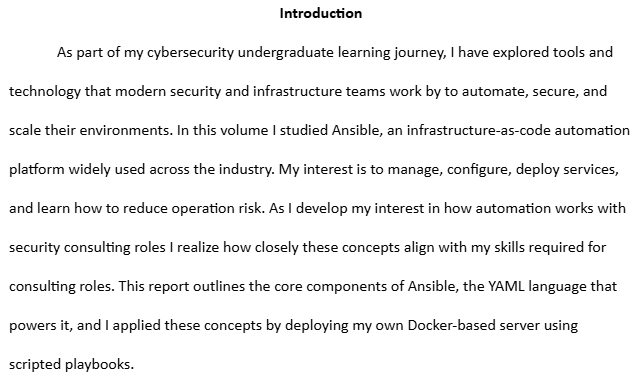

# What-is-Docker-and-Ansible-to-me

## Objective 

Researching what modern technology companies use to scale and support their needs is how I spend my time learning where to apply my skillset. I have discovered Docker and Ansible work together. More importantly in Cisco. I have written my knowledge, deployment and understanding of how this concept transforms todays cybersecuirty archtiecture. 

## Focus Areas: 
Automation, Concepts in Ansible, Scripting

--> [View Full Report (PDF)](reports/madeleine_gordillo_ansible_report.pdf)

### Report Preview 

